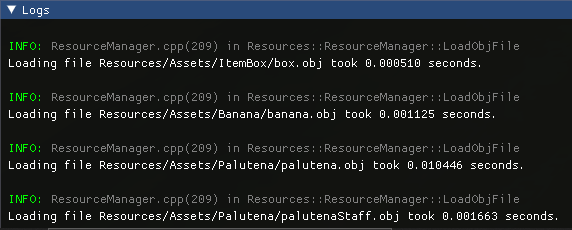

# **Modern OpenGL Multithreaded Engine with Python scripting**

## **Screenshots**

 
 
 

 

## **Features**

### **Start menu**

- The start menu enables the user to access:
  - The editor
  - The game
  - The options
- The editor lets the user modify the scene (no saving implemented).
- The game lets the user play without any ui.
- The options enable keybinding changes.

 

### **Engine windows**

- **Stats:**
    - Shows the current FPS and Delta Time. Target FPS can be modified.
    - Shows the number of vertices in the scene.
    - Shows the speed of the engine camera.
    - Toggles for:
        - Vertical Synchronisation (frame cap = monitor refresh rate)
        - Wireframe view (show edges instead of faces)
        - Collider visibility
        - Asynchronous loading
    - Button to reload all resources.
    - Button to benchmark asset loading and slider to set the number of reloads for the benchmark.

 

- **Play:**
    - ▶ : Starts play mode
    - ⏸︎ : Pauses play mode
    - ⏹ : Stops play mode

 

- **Scene Graph:**
    - Shows all scene objects in a tree structure.
    - Any object can be inspected by clicking on it.
    - Objects that have children can be expanded by clicking the arrow next to their name.
    - Objects can be selected by clicking on their name.
    - Objects can be rearranged by dragging and dropping them on another object.
    - Every object can have one parent and multiple children.
    - Each object's transform is passed down to its children recursively.
    - It is possible to find any object in the scene with its ID or name.
    - Objects that can be added to the scene:
        - Empty objects
        - Mesh groups
        - Cameras
        - Directional, point and spot lights
    - For now, objects can only be reordered by dropping them in the right order onto the root object.

 

- **Inspector:**
    - When an object is selected in the scene graph, it can be edited in this window.
    - For all objects:
        - A text input for the object's name.
        - A remove button to remove the object from the scene.
    - For empty objects:
        - 9 float inputs for the object's position, rotation and scale.
    - For mesh group objects:
        - 9 float inputs for the object's position, rotation and scale.
        - A list of all the mesh group's sub-meshes.  
        Those cannot be transformed independently for now.
        - A list of all the mesh group's materials.  
        Those can be edited in the same way that they are edited in the resource explorer.
    - For camera objects:
        - 6 float inputs for the object's position and rotation.
        - 3 float inputs for the camera's field of view, near plane and far plane.
    - For directional light objects:
        - 3 float inputs for the direction.
        - 3 color inputs for the ambient, diffuse and specular.
    - For point light objects:
        - 3 float inputs for the position.
        - 3 color inputs for the ambient, diffuse and specular.
        - 3 float inputs for the constant, linear and quadratic.
    - For spot light objects:
        - 6 float inputs for the position and direction.
        - 2 float inputs for the outer and inner cones.
        - 3 color inputs for the ambient, diffuse and specular.

 

- **Resources:**
    - Shows all of the currently loaded resources.
    - Allows the user to add any asset to the scene.
    - Primitives collapsing header:
        - This contains 3 primitive shapes: Sphere, Cube, and Capsule.
    - Meshes collapsing header:
        - This contains all of the loaded meshes.
        - Each mesh can be added to the scene using the + button.
        - When expanded, each mesh shows its sub-meshes.
    - Lights collapsing header:
        - This contains 3 light types: Directional, Point and Spot.
    - Materials collapsing header:
        - This shows all of the loaded materials.
        - These can be edited in the following manner:
        - 4 color inputs for ambient, diffuse, specular and emission.
        - 2 float inputs for shininess and transparency.
        - Collapsed tree nodes that show each texture when expanded  
            (ambient, diffuse, specular, emission, shininess, alpha, normal)
    - Textures collapsing header:
        - This shows all of the loaded textures.
        - These can be drag and dropped onto a material's textures to replace them.

 

- **Logs:**
    - Shows the app's logs.
    - Info logs are in green, warnings in yellow and errors in red.
    - Each log shows the file, line number and function where it was created.

 

### **Resources**

- **Textures**
  - Textures are loaded with stbi and stored in the resource manager.
  - Once a texture is loaded, its size and data are stored in a hashed binary file.
  - The hashed file can then be used to retrieve size and data instead of using the original image file.

 

- **Materials**
  - Parsing of .mtl files is implemented.
  - Every material from the file will be added to the resource manager.
  - Pretty much any MTL file can be loaded with the current parser.
  - Supported key words:
    - newmtl
    - Ka, Kd, Ks, Ke, Ns, d, Tr
    - map_Ka, map_Kd, map_Ks, map_Ke, map_Ns, map_d, bump, map_bump, map_Bump
  - When a "map_" statement is encountered, the specified texture is loaded and added to the material.
  - Material properties:
    - ambient, diffuse, specular, emission (RGB colors)
    - shininess, transparency (float values)

 

- **Meshes**
  - Parsing of .obj files is implemented.
  - Every mesh object will be added as a MeshGroup in the resource manager.
  - Every sub mesh will be added to the corresponding MeshGroup.
  - Many OBJ files can be loaded with the current parser.  
    Files that contain quads will be loaded but half the triangles will be missing.
  - Supported key words:
    - mtllib, usemtl
    - o, g
    - v, vt, vn, f
  - When a "mtllib" statement is encountered, the specified MTL file will be loaded.
  - When a "usemtl" statement is encountered, the specified material will be added to the mesh group.

 

- **Shaders**
  - All shaders can be created with the resource manager, but need to be linked and compiled manually.
  - Supported shader types:
    - Vertex shaders
    - Fragment shaders
    - Compute shaders (though nothing is implemented to run them)
    - Shader programs

 

### **Lights**

- **Light Manager**
  - Holds all of the scene's lights.
  - Sends the scene lights' data to the specified shader every frame.

 

- **Directional Lights**
  - Properties:
    - ambient, diffuse, specular (RGB colors)
    - dir (3D vector)

 

- **Point Lights**
  - Properties:
    - ambient, diffuse, specular (RGB colors)
    - constant, linear, quadratic (values for attenuation)
    - pos (3D vector)

 

- **Spot Lights**
  - Properties:
    - ambient, diffuse, specular (RGB colors)
    - outerCone, innerCone (angles in radians)
    - pos, dir (3D vectors)

 

### **Physics**

- Rigidbodies with velocity and acceleration.
- Gravity is applied to a rigidbody's acceleration every frame if it is not kinematic.
- Every frame, a rigidbody's acceleration is transformed into velocity and its velocity into movement.
- Rigidbodies handle collisions between their colliders and the scene colliders.
- To collide with other colliders, objects need a rigidbody.

 

 

### **Collisions**

- Sphere to sphere collision testing implemented.
- GJK implemented for collision testing.
- EPA implemented for collision response.

 

### **Primitive shapes**

- All primitives are created through code:
  - Cube
  - Sphere
  - Capsule
- Primitives can be used as models in the scene.
- They can also be used as colliders for any object.
- Sphere and capsule colliders should not be scaled non uniformly.

 

### **Bounding spheres**

- Every collider has a bounding sphere.
- Collision between two colliders' bounding spheres is checked before checking precise collision.
- Bounding spheres are updated every frame with the collider's transform to account for scale modifications.

 

### **Camera**

- The engine camera can be moved with WASD, Space and Shift in the direction it is looking and rotated with right click and mouse movement.
- The default scene camera uses a Python script to orbit the player and can be rotated with right click and mouse movement.

 

### **Single/multi threaded loading**

- By default, assets are loaded asynchronously by up to 10 threads.
- Resources are first created empty, then filled in by the threads assigned to them.
- In the main thread, we check every frame if each resource has finished loading and send it to OpenGL if that's the case.
- Alternatively, all assets can be loaded one by one, by a single thread.

 

### **Object Scripting**

- Scripts can be added to scene objects.
- Scripts can be written both in C++ and in Python.
- All scripts inherit from the ObjectScript class which implements the following attributes and methods:
    - SceneNode* object
    - Transform* transform
    - Rigidbody* rigidbody
    - AppInputs* inputs
    - Time* time
    - App* app
    - Start()
    - LateStart()
    - Update()
    - LateUpdate()
    - OnCollisionEnter()
    - OnCollisionStay()
    - OnCollisionExit()
- Scene objects will call the previous methods accordingly for every one of their scripts.
- The whole engine is binded to Python using Pybind11.
- This means nearly anything can be done from a python script, for example:
    - Searching for other objects in the scene graph
    - Creating new resources
    - Getting any resource and editing it
    - Modifying most of the C++ objects from the engine
- It is possible to reload all Python scripts by pressing F5 while not in play mode.
- A .pyd dynamic library is generated by a second Visual Studio project into the Scripts folder.

 

### **Shortcomings**
- Camera and lights can be added and edited as scene objects, however their transform doesn't influence their children, and they aren't influenced by their parent's transform.
- The camera manager isn't very well integrated in the engine. This makes it hard to manage scenes with multiple cameras, though it isn't really a problem as long as render textures are not implemented (there is no way to add cameras to a scene and deleting the default camera just hides it from the hierarchy).
- Currently, everything in the scene is rendered with the same shader program. See Resources>Shaders for precisions.
- I did not implement scene saving and loading, which means that currently, the example scene is hardcoded and can only be really modified through code. That is a feature I dipped my toes in but was way too deep to finish in time, so I intend to implement it some time in the future.
- I would have liked to save every resource in binary, the same way as textures. However, it would also be a very time-consuming feature to implement, and since obj parsing is fast in release, I can live with it.
- Sub-meshes can't be transformed independently but it would have been a nice feature.
- I would have liked to implement cubemaps and skyboxes but didn't find the time to.
- Alpha blending is imlemented but broken, because I don't sort meshes before drawing them (this can be seen on the mario kart item box and on palutena).
- Collider rotation is badly handled (it seems like a matrix multiplication is wrong somewhere). However, it is fine if the parent object rotates.
- Sphere to capsule and sphere to sphere collisions can be broken easily (they should have been done with maths and not GJK but time ran out).
- When colliding with multiple objects at once, it is possible to get pushed through one of them by the collision response.
- In incredibly rare cases, only half of a texture can be loaded. 
- In even rarer cases, the resource manager can have a different instance of asset from the loading threads, meaning that asset will not get loaded in the resource manager at all.
- Because of the single-thread oriented architecture the engine originally had, it was not possible to move physics computations or script updates to other threads without reworking everything.
- Logs sent from Python are only shown in the console, and not the engine logs nor the logs file.
- Loading scenes and scene resources through Python scripts is theorically possible but not yet implemented.
